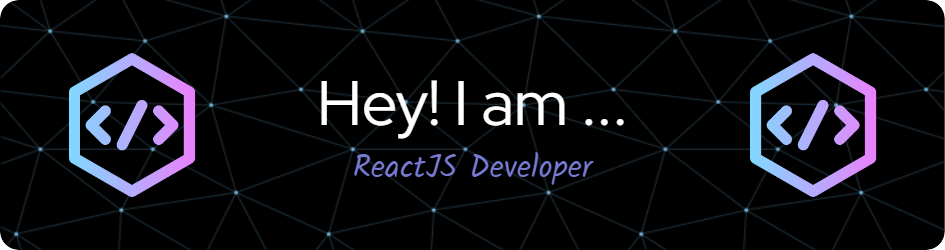

<!-- Header -->

<h1 align="center">I'm Nayan Agarwal </h1>
 
<i>A passionate frontend developer from Vellore Institute Of Technology , Bhopal</i>

<!--   Typing Effect  -->
 
 

 

 <!--  Lines Of Code  -->
 
  

 <!--   About Me  --> 
## <picture></picture> About me  
<!-- Right GIF -->
<picture> </picture>
 
- 🔭 I’m currently working on **My Self🙃**
- 🌱 I’m currently learning **to survive😵‍💫*
- 👨‍💻 All of my projects are available at [https://nayan-ag-portfolio.netlify.app/](https://nayan-ag-portfolio.netlify.app/)
- 💬 Ask me about **ReactJS , Java**
- 📫 How to reach me nayan.agarwal.2022@gmail.com
- 📄 Know about my experiences [https://drive.google.com/file/d/1MUE3v1kNmAucIo9yBD7otCxOD-Ao7RKE/view?usp=share_link](https://drive.google.com/file/d/1n4MaLL7beYijSmjS5sMCXHyKKUtykk4N/view?usp=sharing)
⚡ Fun fact **I think I am Senior Dev.**
  

<!--  Social Platforms  -->
## <picture>  </picture> Connect with me

  

&emsp;

&emsp;

 

<!-- Programming Skills -->
## <picture>  </picture> My Programming Profiles

&emsp;

&emsp;

&emsp;
  

&emsp;

 

<!--   Tech Stack  -->
### <picture>   </picture> Programming language 
&emsp;

  
 
&emsp;

 
&emsp;

 
&emsp;

&emsp;

 
&emsp;

 
&emsp;

 
&emsp;

 

### <picture>   </picture> Software & Tools
&emsp;

  
 
&emsp;

&emsp;
  

&emsp;

&emsp;

&emsp;

 

<!-- Most Used Langyages -->
## Mostly Used Languages
 

 

<!-- GitHub Stats -->
## <picture>   </picture> Github Stats

<!-- LetCode -->

<h3> 💻 LeetCode Stats</h3>

----	

<!-- Streak  Stats -->

<h3> 🔥 Streak Stats</h3>

----	

  
<!-- Contribution Graph -->

<h3>⚡ Contribution Graph </h3>

----	

  

 

<!-- Quote -->

	<a href="https://github.com/piyushsuthar/github-readme-quotes"> 

 

<!-- Visitors -->
## <b> Visitors</b>

  

<!-- Metrics Detialed Summary  -->

Detailed Summary

    
  

    

